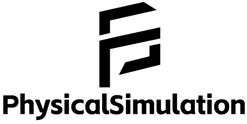

<div align="center">
  
  <br>
  
  
  
  <br>
   
 
  <br>
  <a href="http://beisent.com/docs/#/" target="_blank">项目在线文档</a>
</div>

> [!NOTE]
> **注意：本项目为长期开发项目，功能持续完善中。**

---

## 项目简介

**PhysicalSimulation（简称 PS）** 的目标(尚未完成)是打造一套专注于物理模拟与仿真的工具集，支持刚体动力学、流体力学、分子动力学、有限元分析等多种物理场景的模拟与分析。

- 🚀轻松创建各类物理场景，模拟真实世界物理规律
- ✔支持自定义模型仿真测试
- 🎮提供直观、可交互的可视化界面
- 📊内置丰富数据分析工具，便于高效处理仿真数据
- ✨支持使用 Lua 脚本语言创建或操控对象

---

## 快速开始 
**前置要求**  
- CMake ≥ 3.10
- SDL3 [下载地址](https://github.com/libsdl-org/SDL/releases/tag/release-3.2.14)
- imgui [下载地址](https://github.com/ocornut/imgui)

**请确保已下载 SDL3 & ImGUI 并放置于对应目录，且已安装 CMake。**

### 目录结构

```
PhysicalSimulation
├─bin                   # 可执行文件目录
│   └─SDL3.dll
├─include
│  ├─scenes             # 物理模拟场景
│  └─Dependencies
│      ├─PS             # PS 核心库
│      │  ├─include
│      │  └─src
│      ├─SDL3           # SDL 官方头文件
│      │    ├─SDL3.h
│      │    └─...
│      └─imgui
│           ├─backends  # imgui渲染器
│           │     ├─imgui_impl_sdl3.h
│           │     ├─imgui_impl_sdl3.h
│           │     ├─imgui_impl_sdlrenderer3.cpp
│           │     └─imgui_impl_sdlrenderer3.hpp
│           │ 
│           ├─imgui.cpp # imgui 核心文件
│           └─...
│
├─libs
│  └─SDL3               # SDL 官方静态库
│       └─libSDL3.dll.a
├─res                   # 资源文件
└─src
    └─scenes
```

---


## Windows 环境下构建

> [!TIP]
> 将SDL3.dll放入`bin/`目录，否则运行时会出现DLL缺失错误

### MinGW

1. 下载依赖并放入对应目录。
2. 在项目根目录执行：

    ```shell
    mkdir build
    cd build
    cmake -G "MinGW Makefiles" -DCMAKE_C_COMPILER=gcc -DCMAKE_CXX_COMPILER=g++ ..
    mingw32-make
    ```

### MSVC

1. 下载依赖并放入对应目录。
2. 在项目根目录执行：

    ```shell
    cmake -B build -G "Visual Studio 17 2022" -A x64
    cmake --build build --config Release
    # 调试模式请使用--config Debug  
    ```

    - `-B build`：指定构建输出目录为 build
    - `-G`：指定生成器为 MSVC 2022
    - `-A x64`：选择 64 位架构（可选 Win32 或 ARM）
    - `--config Release`：指定编译模式（可选 Debug 或 Release）

> **注意：**  
> 若选择 `Debug` 模式，生成的可执行文件在 `bin/Debug` 目录下，首次运行时如提示找不到 `SDL3.dll`，请将 `bin` 目录下的 `SDL3.dll` 复制到 `Debug` 目录下（`Release` 同理）。

---

## 演示截图
Pile of boxes

Point Joint

Newton pendulum


---

## 功能特性
- 2D刚体动力学模拟
  - 线性代数类
  - 碰撞检测
    - Narrowphase
      - SAT 算法
      - GJK & EPA 算法
      - CCD 连续碰撞检测
    - Broadphase
      - AABB 轴对齐包围盒
      - 动态层次包围体树
      - 均匀网格法
  - 碰撞点管理
  - 刚体模拟
  - 约束关节
    - 点约束
    - 距离约束
    - 鼠标关节
  - 测试场景
  - 基本 2D 计算几何算法
    - 图元映射
    - 相交测试
    - 凸体检测
    - 三角形三心计算
    - 外/内接圆

## 将要实现的功能
### 2D刚体动力学
- 关节
  - 旋转关节
  - 滑轮关节
  - 转动关节
- 刚体
  - 椭圆
  - 胶囊体
- UI
  - 点击式切换工具
  
### 2D流体模拟
- ​​光滑粒子流体动力学SPH
- 基于位置的动力学模拟PBD/PBF 
  - 布料
  - ​​绳索、头发
  - 气体
- 网格法

### 3D刚体动力学模拟

  
---

## 参考与致谢
- [《基于物理的建模与动画》](https://book.douban.com/subject/35287308/)
- [《流体动画引擎开发：理论与实践》](https://book.douban.com/subject/36875124/)
- [《流体动画的计算艺术》](https://book.douban.com/subject/30269335/)
- [《实时碰撞检测算法技术》](https://book.douban.com/subject/4861957/)
- [《游戏物理引擎开发》](https://book.douban.com/subject/25821830/)
- [FLAT](https://github.com/yuanming-hu/FLAT)
- [Unity3dCCD](https://docs.unity3d.com/Manual/ContinuousCollisionDetection.html)
- [Box2DCCD](https://box2d.org/files/ErinCatto_ContinuousCollision_GDC2013.pdf)
- [Let's Make a Physics Engine](https://www.youtube.com/watch?v=lzI7QUyl66g&list=PLSlpr6o9vURwq3oxVZSimY8iC-cdd3kIs)
- [PixelPhysics](https://www.youtube.com/@pixel_physics)
- [2D凸多边形碰撞检测算法](https://zhuanlan.zhihu.com/p/178841676)
- [游戏物理引擎笔记](https://www.zhihu.com/column/c_1286651106643099648)
- [jMonkeyEngine 初学者教程（中文版）](https://www.jmecn.net/tutorial-for-beginners/chapter-16-physics-engine.hpptml)
- [游戏开发物理学](https://cread.jd.com/read/startRead.action?bookId=30358337&readType=1)
- [SDL Wiki](https://wiki.libsdl.org/SDL3/Tutorials/FrontPage)
- [Unity3D Scripting API](https://docs.unity3d.com/ScriptReference/)
- [Cppreference](https://zh.cppreference.com/)
- [BOX2D](https://github.com/erincatto/box2d)
- [Physics2D](https://github.com/acrlw/Physics2D)
- [dyn4j](https://github.com/dyn4j/dyn4j)
- [matterjs](https://github.com/liabru/matter-js)
- [nphysics](https://github.com/dimforge/nphysics)
- [Box2D Publications](https://box2d.org/publications/)
- [dyn4j Official Blog](https://dyn4j.org/blog/)
- [Game Physics For Beginners - liabru](https://brm.io/game-physics-for-beginners/)
- [Allen Chou's Blog](http://allenchou.net/game-physics-series/)
- [Physics Constraints Series - Allen Chou](https://www.youtube.com/c/MingLunChou/videos)
- [Soft Constraints - ODE](https://ode.org/ode-latest-userguide.hpptml#sec_3_8_0)
- [Gaffer's on Games](https://gafferongames.com/#posts)
- [Randy Gaul's Blog](https://randygaul.github.io/)
- [Winter's Dev](https://blog.winter.dev/)
- [Primitives and Intersection Acceleration](https://www.pbr-book.org/3ed-2018/Primitives_and_Intersection_Acceleration/Bounding_Volume_Hierarchies)
- [Real-Time Rendering Intersection](http://www.realtimerendering.com/intersections.hpptml)
- [Inigo Quilez's 2D SDF Functions](https://www.iquilezles.org/www/articles/distfunctions2d/distfunctions2d.hpptm)
- [*A Simple Time-Corrected Verlet Integration Method* - Jonathan Dummer](https://archive.gamedev.net/archive/reference/programming/features/verlet/)
- [*Introduction to rigid body pipeline, collision detection* - Erwin Coumans](https://docs.google.com/presentation/d/1wGUJ4neOhw5i4pQRfSGtZPE3CIm7MfmqfTp5aJKuFYM/edit#slide=id.g644a5aa5f_1_116)
- *Foundations of Physically Based Modeling and Animation* - Donald House and John C. Keyser
- *Real-Time Collision Detection* by Christer Ericson
- *Game Programming Gems 7* - Scott Jacobs
- *Game Physics Cookbook* - Gabor Szauer
